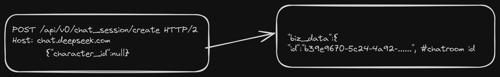

<p align="center"><sup>An unofficial free deepseek api wrapper written in python.</sup></p>

A totally free deepseek api(with latest R1 model) written in python.[WIP]

## Required Cookies
Create an account in [deepseek.com](https://www.deepseek.com/) and visit [chat.deepseek.com](https://chat.deepseek.com/) and copy the following cookies
```sh
smidV2
HMACCOUNT
Hm_lpvt_fb5acee01d9182aabb2b61eb816d24ff
intercom-session-guh50jw4
HWWAFSESTIME
Hm_lvt_fb5acee01d9182aabb2b61eb816d24ff
HWWAFSESID
.thumbcache_6b2e5483f9d858d7c661c5e276b6a6ae
Hm_lvt_1fff341d7a963a4043e858ef0e19a17c
intercom-device-id-guh50jw4
__cf_bm
ds_session_id
Hm_lpvt_1fff341d7a963a4043e858ef0e19a17c
```
and from **Local Storage** collect ``userToken`` value part

## CodeFlow (sorta)
1. Creating a chatroom
