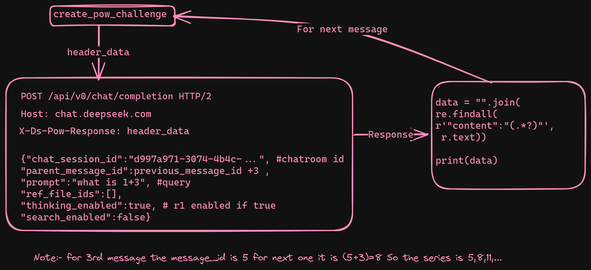

<p align="center"><sup>An unofficial free deepseek api wrapper written in python.</sup></p>

A totally free deepseek api(with latest R1 model) written in python.[WIP]

## Required Cookies
Create an account in [deepseek.com](https://www.deepseek.com/) and visit [chat.deepseek.com](https://chat.deepseek.com/) and copy the following cookies
```sh
smidV2
HMACCOUNT
Hm_lpvt_fb5acee01d9182aabb2b61eb816d24ff
intercom-session-guh50jw4
HWWAFSESTIME
Hm_lvt_fb5acee01d9182aabb2b61eb816d24ff
HWWAFSESID
.thumbcache_6b2e5483f9d858d7c661c5e276b6a6ae
Hm_lvt_1fff341d7a963a4043e858ef0e19a17c
intercom-device-id-guh50jw4
__cf_bm
ds_session_id
Hm_lpvt_1fff341d7a963a4043e858ef0e19a17c
```
and from **Local Storage** collect ``userToken`` value part

## http headers
```sh
headers={

    "User-Agent": "Mozilla/5.0 (Windows NT 10.0; Win64; x64; rv:134.0) Gecko/20100101 Firefox/134.0",
    "Accept": "*/*",
    "Accept-Language": "en-US,en;q=0.5",
    "Accept-Encoding": "gzip, deflate, br",
    "X-Client-Platform": "web",
    "X-Client-Version": "1.0.0-always",
    "X-Client-Locale": "en_US",
    "X-App-Version": "20241129.1",
    "Authorization": "Bearer {userToken}", #collected from local storage
    "Origin": "https://chat.deepseek.com", 
    "Referer": "https://chat.deepseek.com/", #change to 'https://chat.deepseek.com/a/chat/s/{chatroom_id}' after chatroom creation
    "Sec-Fetch-Dest": "empty",
    "Sec-Fetch-Mode": "cors",
    "Sec-Fetch-Site": "same-origin",
    "Priority": "u=0",
    "Te": "trailers",
}
```

## CodeFlow (sorta)
1. Creating a chatroom


2. Util Function ``create_pow_challenge``


3. Ai responses\
The api endpoint for this is ``/api/v0/chat/completion``

    **First Message**
    

    **Second Message**
    

    **Third message and onwards**
    

## Todo
1. Scrape for file upload
2. Code implementation in python